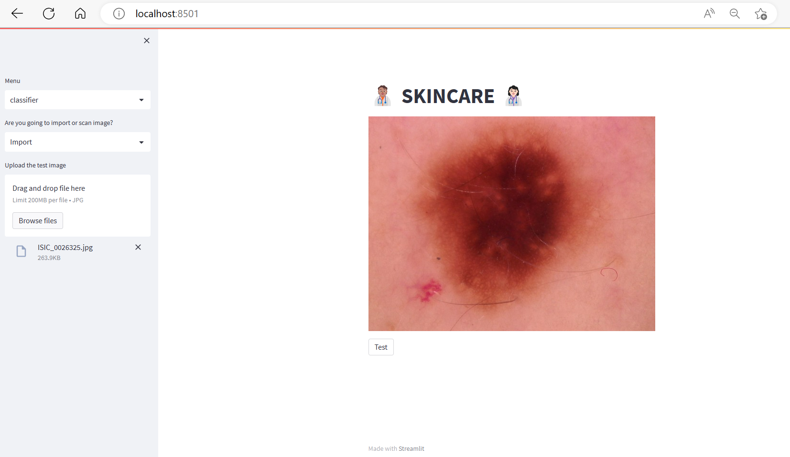

# challenge-mole

## General Description of the project
 Them main objective of the project is to create an AI that can detect when the mole is dangerous. And to be able to deploy it, with a simple web page where the user could upload a picture of the mole and see the result.


 


## Deployment 


The application is deployable  with streamlit. 


1. Install virtualenv

```bash
pip install virtualenv
```
2. Create a virtual environment and activate it
```bash
virtualenv venv
> On windows -> venv\Scripts\activate
> On Linux -> . env/bin/activate

```
3. Install the necessary libraries
```bash
pip install -r requirements.txt

```
4. Run app.py
```bash
streamlit run app.py

```


	

